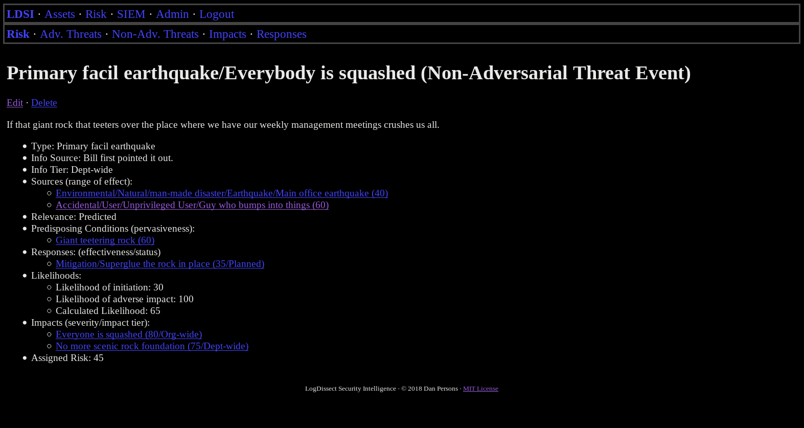

# LogDissect Security Intelligence

## Index

- [Introduction](#introduction)
- [Installing](#installing)
- [Daemons](#daemons)
- [Screenshots](#screenshots)

## Introduction
LDSI is a SIEM (Security Information and Event Management system) written in Python Django. It features a web frontend, and handles log management and forensics, risk management, and asset management.

### Design Principles
#### Security
LDSI was designed and built as a security application, and minimalism can be good for security.

##### Log Sources
LDSI does not require credentials, or installation of its software, on log sources. Event forwarding is left entirely up to syslog daemons.

##### Web Clients
LDSI uses no client-side scripting.

#### [NIST](https://www.nist.gov/) guidelines
The LDSI risk management system is based on NIST [risk assessment](https://csrc.nist.gov/publications/detail/sp/800-30/rev-1/final) guidelines, and the SIEM and forensics apps are designed to support the NIST [incident response](https://csrc.nist.gov/publications/detail/sp/800-61/rev-2/final) and [forensics](https://csrc.nist.gov/publications/detail/sp/800-86/final) guidelines.

#### Simplicity
LDSI embraces the Unix design philosophy. It is designed to be as simple as possible, in order to be easy to understand, use, maintain, and extend.

### Applications
LDSI includes a few different applications:
- SIEM - Security Information and Event Management
- Assets - Asset Management
- Risk - Risk Management

## Installing
Requirements: python 3.x, django >=2.0, git, pip.

Note: This installation is intended for development, and trying out the software. Using the built-in Python Django web server is not recommended in real security operations environments. In production environments, LDSI should be configured by a professional with experience securing production servers.

#### Step 1
- Download the release:
```
git clone https://github.com/dogoncouch/ldsi.git
```

#### Step 2
- Create a virtual environment and install django:
```
virtualenv -p python3 ldsi_env
source ldsi_env/bin/activate
pip install django
```

#### Step 3
- Create/migrate the database, and add fixtures:
```
cd ldsi
make new-db
```

#### Step 4
- Start the server:
```
python manage.py runserver
```

#### Step 5
- Try it: http://localhost:8000

#### Step 6
- Set up syslog service, clients

## Daemons
### start.sh
Parser and sentry daemons can be started, restarted, and stopped with start.sh, which includes options for setting the LDSI base directory and virtual environment base directory.
```
Usage: start.sh [-hv] <directory> <command>

Optional arguments:
  -h                      Print this help message
  -v                      Print the version number
  -r                      Restart daemons
  -k                      Stop daemons
  -c                      Clean old events using backup EOL date
  -l                      Clean old events using local EOL date
  -b <ldsi-base>          Set the LDSI base directory
  -e <env-base>           Set a virtual environment
```

The parser configuration file is at `config/parser.conf`. Cleaning should be handled by a cron job. `start.sh` can be run manually, or by `/etc/rc.local`.

## Screenshots

### SIEM

#### Log event search:


#### Log event detail view:


#### Rule event search:


#### Rule event detail view:


### Risk Management

#### Adversarial threat event index:


#### Adversarial threat event detail:


#### Non-adversarial threat event detail:

