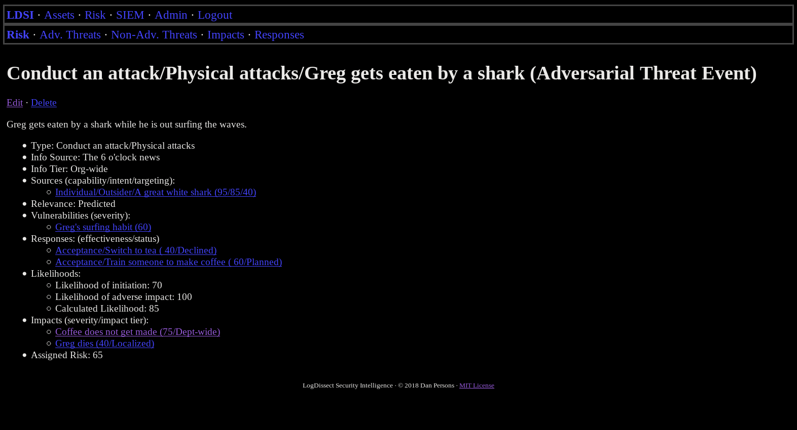

# LogDissect Security Intelligence
LDSI is a SIEM (Security Information and Event Management system) written in Python Django. It features a web frontend, and handles log management and forensics, risk management, and asset management.

## Index

- [Introduction](#introduction)
- [Installing](#installing)
- [Daemons](#daemons)
- [Screenshots](#screenshots)

## Introduction

### Applications
LDSI applications:
- Assets - Asset Management
- Risk - Risk Management (based on [NIST SP 800-30r1](https://csrc.nist.gov/publications/detail/sp/800-30/rev-1/final))
- SIEM - Security Information and Event Management

### Design Principles
#### [NIST](https://www.nist.gov/) guidelines
The LDSI risk management system is based on NIST [risk management](https://csrc.nist.gov/publications/detail/sp/800-30/rev-1/final) guidelines, and the SIEM and forensics apps are designed to support the NIST [incident response](https://csrc.nist.gov/publications/detail/sp/800-61/rev-2/final) and [forensics](https://csrc.nist.gov/publications/detail/sp/800-86/final) guidelines.

#### Simplicity
LDSI embraces the Unix design philosophy. It is designed to be as simple as possible, in order to be easy to understand, use, maintain, and extend.

## Installing
Follow the installation instructions for the [latest release](https://github.com/dogoncouch/ldsi/releases/latest).

## Installing development source
Requirements: python 3.x, django >=2.0, git, pip.

Note: This installation is intended for development, and trying out the software. Using the built-in Python Django web server is not recommended in real security operations environments.

### Step 1
- Download the release:
```
git clone https://github.com/dogoncouch/ldsi.git
```

### Step 2
- Create a virtual environment and install django:
```
virtualenv -p python3 ldsi_env
source ldsi_env/bin/activate
pip install django
```

### Step 3
- Create/migrate the database, and add fixtures:
```
cd ldsi
make new-db
```

### Step 4
- Start the server:
```
python manage.py runserver
```

### Step 5
- Try it: http://localhost:8000

### Step 6
- Set up syslog service, clients

## Daemons
### Parser Engine
To start the parser engine:

1. Edit the config file at `config/parser.conf`.
2. Run the parser inside a django shell:
```
python manage.py shell -c "import daemons.parser.parsecore ; daemons.parser.parsecore.start()"
```

The parser needs to be restarted on changes to the config file.

### Sentry Engine
To start the rule engine:

1. Run the sentry engine inside a django shell:
```
python manage.py shell -c "import daemons.sentry.sentrycore ; daemons.sentry.sentrycore.start()"
```

### Cleaner
Events have two different EOL dates for local and backup copies of events. The cleaner can use either to delete old events. There are two options:

1. Run the cleaner inside a django shell using the backup EOL date:
```
python manage.py shell -c "import daemons.cleaner.clean ; daemons.cleaner.clean.clean()"
```
2. Run the cleaner inside a django shell using the local EOL date:
```
python manage.py shell -c "import daemons.cleaner.clean ; daemons.cleaner.clean.clean(local=True)"
```

Cleaning should be handled by a cron job.

## Screenshots

### SIEM

#### Log event search:


#### Log event detail view:


#### Rule event search:


#### Rule event detail view:


### Risk Management

#### Adversarial threat event index:


#### Adversarial threat event detail:


#### Non-adversarial threat event detail:

